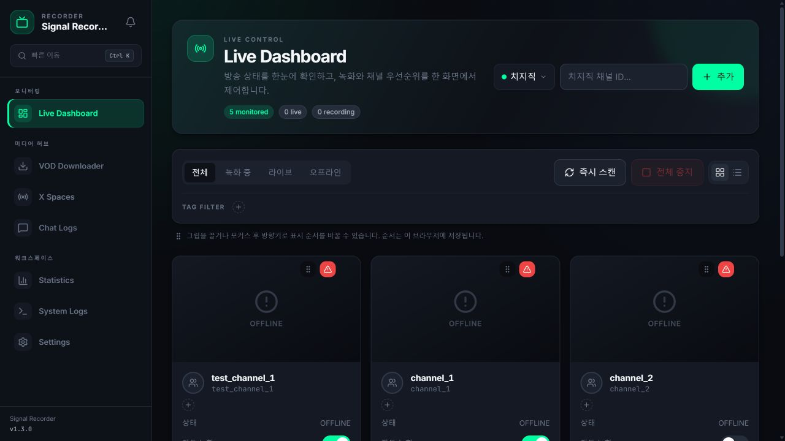
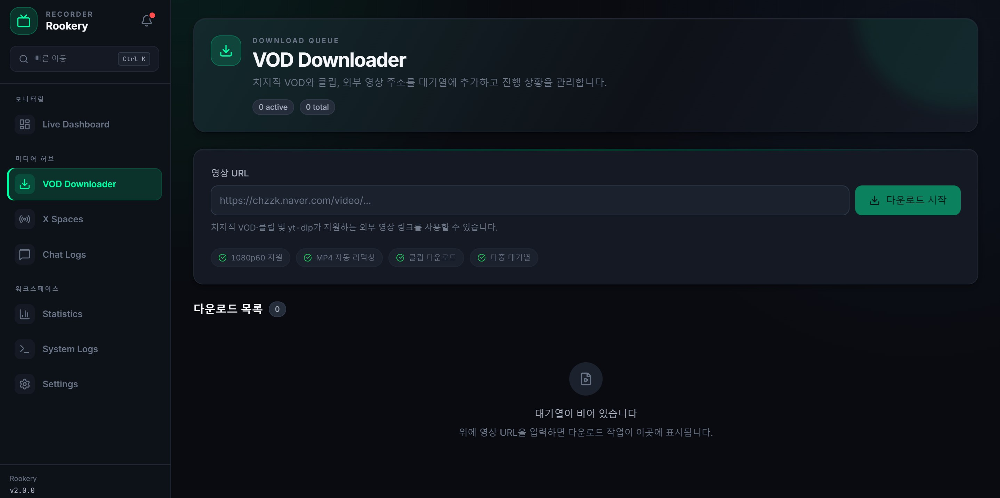

# Signal-Recorder


치지직, TwitCasting, X Spaces, YouTube 라이브를 한 화면에서 감시하고 자동 녹화하는 개인용 미디어 아카이빙 워크스페이스입니다. VOD 다운로드, 채팅 보관, 통계, 시스템 로그와 Discord 알림까지 하나의 웹 UI에서 관리합니다.

> 이 프로젝트는 개인 소장 용도로 제작되었습니다. 사용자는 각 플랫폼의 약관과 저작권법을 확인하고 준수해야 합니다.

## 최신 UI

아래 이미지는 현재 소스(v1.3.0)를 로컬에서 직접 실행해 촬영한 화면입니다.

### Live Dashboard



### VOD Downloader



## 무엇이 달라졌나요?

- 방송 제어 화면에 맞춘 다크 컨트롤룸 디자인과 반응형 사이드바
- 공통 페이지 헤더, 상태 배지, 지표 카드, 빈 상태 및 확인 모달로 일관된 화면 구성
- `Ctrl + K` 명령 팔레트, 앱 알림 센터, 진행 중 다운로드 요약
- 대시보드의 카드/리스트 보기, 상태·태그 필터, 전체 즉시 스캔과 전체 중지
- 채널 카드의 그립 핸들을 잡아 원하는 위치로 이동하는 사용자 지정 정렬
- 마우스·터치 드래그뿐 아니라 핸들 포커스 후 방향키로도 채널 순서 변경
- 설정을 일반, 다운로드, 인증, 알림, 외관, 시스템, 정보의 7개 탭으로 분리
- 페이지 타이틀, 파비콘, 포인트 컬러를 브라우저별로 사용자 지정

> 채널 순서는 현재 브라우저의 로컬 저장소에 보관되므로 새로고침 후에도 유지됩니다. 다른 브라우저나 기기와 자동 동기화되지는 않습니다.

## 핵심 기능

### 멀티 플랫폼 라이브 녹화

| 플랫폼 | 라이브 감시·녹화 | 부가 기능 | 준비 사항 |
|---|:---:|---|---|
| 치지직 | ✅ | 채팅 JSONL, VOD·클립 다운로드 | 일반 방송은 바로 사용, 연령 제한·고화질은 네이버 쿠키 권장 |
| TwitCasting | ✅ | 과거 방송 조회·다운로드 | Client ID / Client Secret |
| X Spaces | ✅ | master URL 자동 백업, 수동 캡처·M4A 다운로드 | Netscape 형식 X 쿠키 파일 |
| YouTube | ✅ | 라이브 감시, yt-dlp 기반 외부 영상 다운로드 | 기본 기능은 별도 인증 없음 |

- 등록 채널의 방송 시작을 감지해 자동 녹화
- 채널별 자동 녹화 전환과 수동 시작·중지
- 연결이 끊기면 설정한 횟수만큼 자동 재시도
- 최고 화질, 1080p, 720p, 480p 선택
- 라이브는 TS 권장, MKV 및 MP4 선택 가능
- 녹화·치지직 VOD·외부 URL의 저장 경로를 각각 분리 가능

TS와 MKV는 비정상 종료 시에도 이미 받은 구간을 보존하기 쉬워 라이브 녹화에 적합합니다. MP4는 호환성이 좋지만 라이브 중단 시 손상될 수 있어 VOD에 권장합니다.

### VOD 다운로드 큐

- 치지직 VOD·클립과 yt-dlp가 지원하는 외부 영상 URL 추가
- 여러 작업의 동시 다운로드 수, 기본 화질, 포맷, 속도 제한 설정
- 드래그 앤 드롭으로 대기열 우선순위 변경
- 일시정지, 재개, 취소, 실패 작업 재시도
- 완료 파일 위치 열기 및 완료·오류 작업 일괄 정리
- 중단된 `.part` 파일 보관 여부 선택

### X Spaces와 아카이브

- X Space URL 또는 캡처된 `master_playlist.m3u8` URL로 오디오 저장
- 감지한 master URL을 `{다운로드 경로}/x_spaces_urls/`에 텍스트 파일로 백업
- TwitCasting 채널의 과거 방송 목록 조회 및 다운로드
- Discord 명령을 이용한 Space 수동 캡처와 다운로드

### 채팅, 통계, 로그

- 녹화 중 치지직 채팅을 JSONL 파일로 자동 보관
- 채널·날짜별 파일 탐색, 메시지 검색, 닉네임 필터, 페이지 이동과 원본 다운로드
- 총 녹화 시간·용량, VOD 완료 수, 채널별 통계와 최근 세션 표시
- 실시간 `service.log`와 일자별 로그 파일 조회
- 로그 검색, 100/500/1000줄 또는 전체 조회, 5초 자동 갱신과 자동 스크롤

### Discord 알림

- 녹화 시작·완료·실패, 다운로드 완료 등 이벤트별 수신 설정
- Discord Bot 또는 Webhook 단독 사용
- Bot 장애 시 Webhook 폴백
- 알림별 멘션 대상과 유효 시간(TTL) 설정
- 전송 대기·성공·폐기·만료 상태 확인 및 테스트 발송

지원하는 주요 Bot 명령은 다음과 같습니다.

| 명령 | 설명 |
|---|---|
| `/status` | 현재 녹화 상태 |
| `/list` | 등록 채널 목록 |
| `/start <채널ID>` | 녹화 시작 및 자동 녹화 활성화 |
| `/stop <채널ID>` | 녹화 중지 및 자동 녹화 비활성화 |
| `/rescan` | 모든 채널 즉시 스캔 |
| `/spaces` | 캡처된 Space 목록 |
| `/capture-space <핸들>` | Space URL 즉시 캡처 |
| `/download-space <URL>` | Space 또는 master URL 다운로드 |
| `/diag` | 알림 큐와 전송 채널 상태 진단 |
| `/notify-test` | 알림 채널로 테스트 알림 발송 |

명령을 실행할 수 있는 사용자와 채널은 설정 → 알림 탭에서 제한할 수 있습니다.
아무것도 지정하지 않으면 알림 채널에서만 동작하며, 알림 채널조차 없으면 모든 명령이 거부됩니다.

## 화면 구성

| 화면 | 용도 |
|---|---|
| Live Dashboard | 채널 추가, 상태 확인, 필터, 순서 변경, 녹화 제어 |
| VOD Downloader | 다운로드 작업 추가와 큐 관리 |
| X Spaces | Space URL 또는 master URL 오디오 다운로드 |
| Chat Logs | 저장된 채팅 탐색과 검색 |
| Statistics | 녹화·저장 공간·채널별 통계 |
| System Logs | 서비스 로그 검색과 실시간 추적 |
| Settings | 저장 경로, 포맷, 인증, 알림, 외관, 업데이트 관리 |

## 설치

### Windows 실행 파일

Python을 별도로 설치하지 않고 사용할 수 있는 방법입니다.

1. [Releases](https://github.com/eruminyu/Signal-Recorder/releases)에서 최신 `signal-recorder.exe`를 받습니다.
2. 실행 파일을 열고 의존성 안내를 따릅니다.
3. 자동으로 열리는 브라우저 또는 `http://localhost:8000`에 접속합니다.

Windows Defender가 서명되지 않은 실행 파일을 경고할 수 있습니다. 소스를 확인한 뒤 신뢰할 수 있을 때만 **추가 정보 → 실행**을 선택하세요.

### Linux / macOS 네이티브 설치

```bash
curl -fsSL https://raw.githubusercontent.com/eruminyu/Signal-Recorder/main/scripts/install.sh | bash
```

스크립트는 운영체제 확인, Python·Node.js·FFmpeg 준비, 프론트엔드 빌드, 가상환경 구성과 선택적 systemd 등록을 진행합니다.

```bash
~/signal-recorder/start.sh
```

자세한 내용은 [Linux 설치 가이드](docs/linux-guide.md)를 참고하세요.

### Docker

자동 설치:

```bash
curl -fsSL https://raw.githubusercontent.com/eruminyu/Signal-Recorder/main/scripts/install-docker.sh | bash
```

이미 Docker와 Compose가 설치되어 있다면 저장소 루트에서 직접 실행할 수 있습니다.

```bash
docker compose up --build -d
```

기본 포트는 `8000`이며 `.env`의 `PORT`로 변경할 수 있습니다. 데이터는 다음 경로에 영속화됩니다.

```yaml
volumes:
  - ./config:/app/config
  - ./recordings:/app/backend/recordings
  - ./data:/app/backend/data
  - ./logs:/app/backend/logs
```

호스트 저장 경로를 바꾸려면 콜론 왼쪽 경로만 수정하세요. 자세한 내용은 [Docker 가이드](docs/docker-guide.md)를 참고하세요.

## 소스에서 실행

### 요구 사항

| 항목 | 요구 버전·설명 |
|---|---|
| Python | 3.12.10 권장 (`backend/.python-version`) |
| Node.js | 20 이상 (22 또는 24 LTS 권장) |
| FFmpeg | 6 이상 |
| yt-dlp | Python 요구 패키지에 포함되며 실행 파일을 PATH 또는 `bin/`에서 탐색 |
| 메모리 | 2GB 이상, 여러 동시 작업은 4GB 이상 권장 |

### 설치와 프로덕션 빌드

```bash
git clone https://github.com/eruminyu/Signal-Recorder.git
cd Signal-Recorder

python -m venv backend/.venv
```

Windows PowerShell:

```powershell
backend\.venv\Scripts\python -m pip install -r backend\requirements.txt
cd frontend
npm ci
npm run build
cd ..
backend\.venv\Scripts\python -m uvicorn app.main:app --app-dir backend
```

Linux / macOS:

```bash
backend/.venv/bin/python -m pip install -r backend/requirements.txt
cd frontend
npm ci
npm run build
cd ..
backend/.venv/bin/python -m uvicorn app.main:app --app-dir backend
```

`npm run build`의 결과는 `backend/app/static/`에 생성되며 FastAPI가 같은 포트에서 UI와 API를 함께 제공합니다.

### 개발 모드

터미널 두 개에서 각각 실행합니다.

```powershell
# terminal 1
backend\.venv\Scripts\python -m uvicorn app.main:app --reload --app-dir backend

# terminal 2
cd frontend
npm run dev
```

- 프론트엔드: `http://localhost:3000`
- 백엔드와 API 문서: `http://localhost:8000`, `http://localhost:8000/docs`
- Windows에서는 의존성 설치 후 `start-dev.bat`로 두 프로세스를 함께 열 수 있습니다.

## 첫 실행 설정

첫 실행 시 3단계 설정 마법사가 열립니다.

1. 녹화 저장 경로, 화질, 라이브 포맷 선택
2. 치지직 인증 쿠키 입력 또는 건너뛰기
3. 설정 검토 후 저장

추가 인증은 **Settings → 인증**에서 구성합니다.

### 치지직

네이버 로그인 후 브라우저 개발자 도구의 `naver.com` 쿠키에서 `NID_AUT`, `NID_SES`를 확인해 입력합니다. 쿠키는 연령 제한 방송과 로그인 기반 화질 접근에 필요할 수 있습니다.

### TwitCasting

[TwitCasting Developer](https://twitcasting.tv/developer.php)에서 앱을 등록하고 Client ID와 Client Secret을 입력합니다.

### X Spaces

`x.com`에 로그인한 브라우저의 쿠키를 Netscape 형식 `.txt` 파일로 내보내 업로드합니다. 쿠키는 만료될 수 있으므로 캡처가 실패하면 다시 발급하세요. 자세한 내용은 [X Spaces 설정 가이드](docs/x-spaces-guide.md)를 참고하세요.

### Discord

Bot 토큰과 알림 채널 ID 또는 Webhook URL 중 하나를 입력합니다. 명령은 슬래시 커맨드 전용이므로 Message Content Intent를 켤 필요가 없습니다. 알림만 필요하다면 Bot 없이 Webhook URL만 설정해도 됩니다.

## 설정과 데이터

서버 설정은 프로젝트 루트의 `.env`를 사용합니다. Windows 실행 파일은 실행 파일 옆 `.env`, Docker는 `config/.env`를 사용합니다. 대부분의 항목은 웹 설정 화면에서 저장할 수 있습니다.

자주 사용하는 환경 변수:

```dotenv
PORT=8000
FFMPEG_PATH=ffmpeg
DOWNLOAD_DIR=./recordings
LIVE_FORMAT=ts
RECORDING_QUALITY=best
MONITOR_INTERVAL=30
```

기본 데이터 위치:

| 경로 | 내용 |
|---|---|
| `backend/data/signal_recorder.db` | 채널, 녹화·VOD 이력, 태그, 알림 큐 |
| `backend/recordings/` | 기본 녹화·다운로드 파일 |
| `logs/` | 서비스 로그 (프로젝트 루트 기준) |
| `{DOWNLOAD_DIR}/x_spaces_urls/` | 캡처된 X Spaces master URL 백업 |

저장 구조와 마이그레이션은 [스토리지 문서](docs/storage.md)를 참고하세요.

## 테스트와 검증

```bash
python -m pip install -r backend/requirements-dev.txt
python -m pytest -c backend/pytest.ini backend/tests

cd frontend
npm run build
```

멀티 플랫폼 점검 절차는 [테스트 가이드](docs/test-guide.md)를 참고하세요.

## 프로젝트 구조

```text
Signal-Recorder/
├── backend/
│   ├── app/
│   │   ├── api/          # FastAPI 라우터
│   │   ├── core/         # 설정, 로깅, HTTP 공통 코드
│   │   ├── engine/       # 플랫폼 감시, 녹화, VOD 파이프라인
│   │   ├── services/     # 녹화·Discord·알림 서비스
│   │   └── store/        # SQLite 저장소와 마이그레이션
│   └── tests/
├── frontend/
│   └── src/
│       ├── components/   # 대시보드, 설정, 레이아웃, 공통 UI
│       ├── contexts/     # 다운로드 상태
│       ├── hooks/        # 실시간 채널 스트림
│       └── pages/        # 7개 주요 화면
├── assets/screenshots/   # README 실행 화면
├── docs/                 # 설치·설계·운영 문서
└── scripts/              # 네이티브·Docker 설치 및 실행 스크립트
```

## 문제 해결

<details>
<summary>FFmpeg 또는 yt-dlp를 찾지 못합니다.</summary>

FFmpeg 6 이상과 yt-dlp를 시스템 PATH에 추가하거나 프로젝트 또는 실행 파일 옆 `bin/` 폴더에 배치하세요. FFmpeg를 별도 위치에 두었다면 `.env`의 `FFMPEG_PATH`에 실행 파일 경로를 지정할 수 있습니다.

</details>

<details>
<summary>포트 8000이 이미 사용 중입니다.</summary>

`.env`에서 `PORT=8001`처럼 변경합니다. Docker는 같은 값을 Compose 포트 매핑에 사용합니다.

</details>

<details>
<summary>채널 카드 순서가 다른 기기에서 보이지 않습니다.</summary>

대시보드 정렬은 계정이나 서버가 아니라 현재 브라우저에 저장됩니다. 같은 브라우저에서는 새로고침 후 유지되지만 다른 기기·브라우저에는 별도로 정렬해야 합니다.

</details>

<details>
<summary>연령 제한 치지직 방송을 녹화할 수 없습니다.</summary>

Settings → 인증에서 `NID_AUT`, `NID_SES`를 새 값으로 저장한 뒤 검증하세요. 네이버 로그인 쿠키는 주기적으로 만료됩니다.

</details>

<details>
<summary>X Spaces 다운로드 결과가 비어 있습니다.</summary>

쿠키 만료 여부를 먼저 확인하고 `{DOWNLOAD_DIR}/x_spaces_urls/`에 저장된 master URL 백업으로 다시 시도하세요. 종료 후 오래되었거나 비공개인 Space는 원본 CDN에서 더 이상 제공되지 않을 수 있습니다.

</details>

## 라이선스와 고지

[MIT License](LICENSE)로 배포됩니다.

Signal-Recorder는 FFmpeg를 직접 번들하지 않습니다. FFmpeg에는 빌드 구성에 따라 LGPL 또는 GPL이 적용될 수 있으므로 [FFmpeg License](https://ffmpeg.org/legal.html)를 확인하세요.

- 다운로드한 콘텐츠를 무단 재배포하거나 상업적으로 이용하지 마세요.
- 플랫폼 인증 정보와 계정 보안은 사용자가 직접 관리해야 합니다.
- 비공개 API와 플랫폼 구조는 예고 없이 바뀔 수 있습니다.
- 개발자는 도구의 오용이나 서비스 약관 위반에 대한 책임을 지지 않습니다.
